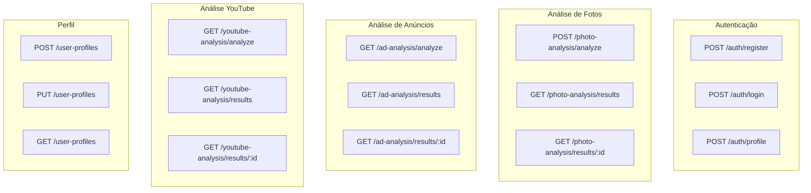

# Superfície de API

> **Gerado em:** 2026-07-15 | **Branch:** master | **Commit:** d137093

## Visão Geral

A aplicação consome uma API REST backend exposta em `VITE_BASE_SERVER_URL`. Todos os endpoints requerem autenticação JWT via header `Authorization: Bearer <token>`, exceto `/auth/register` e `/auth/login`.

---

## Diagrama de Endpoints

---

## Detalhamento dos Endpoints

### `/auth/register`

| Aspecto | Detalhe |
|---------|---------|
| Método | POST |
| Auth | Não |
| Body | `{ username: string, password: string }` |
| Response 200 | `{ userId?: number, username?: string, message?: string }` |

### `/auth/login`

| Aspecto | Detalhe |
|---------|---------|
| Método | POST |
| Auth | Não |
| Body | `{ username: string, password: string }` |
| Response 200 | `{ access_token: string }` |

### `/auth/profile`

| Aspecto | Detalhe |
|---------|---------|
| Método | POST |
| Auth | Sim |
| Response 200 | `{ username: string }` |

### `/photo-analysis/analyze`

| Aspecto | Detalhe |
|---------|---------|
| Método | POST |
| Auth | Sim |
| Content-Type | multipart/form-data |
| Body | FormData com campo `imagem` (Blob/File) |
| Response 200 | `PhotoAnalysisResult` |

### `/photo-analysis/results`

| Aspecto | Detalhe |
|---------|---------|
| Método | GET |
| Auth | Sim |
| Params | `page: number, limit: number` |
| Response 200 | `PaginatedResponse<PhotoAnalysisListItem>` |

### `/photo-analysis/results/:id`

| Aspecto | Detalhe |
|---------|---------|
| Método | GET |
| Auth | Sim |
| Response 200 | `PhotoAnalysisDetail` |

### `/ad-analysis/analyze`

| Aspecto | Detalhe |
|---------|---------|
| Método | GET |
| Auth | Sim |
| Params | `image_url: string` |
| Timeout | 120 000 ms |
| Response 200 | `AdAnalysisResult` |

### `/ad-analysis/results`

| Aspecto | Detalhe |
|---------|---------|
| Método | GET |
| Auth | Sim |
| Params | `page: number, limit: number` |
| Response 200 | `PaginatedResponse<AdAnalysisListItem>` |

### `/ad-analysis/results/:id`

| Aspecto | Detalhe |
|---------|---------|
| Método | GET |
| Auth | Sim |
| Response 200 | `AdAnalysisResult` |

### `/youtube-analysis/analyze`

| Aspecto | Detalhe |
|---------|---------|
| Método | GET |
| Auth | Sim |
| Params | `url: string` |
| Timeout | 120 000 ms |
| Response 200 | `YouTubeAnalysisResult` |

### `/youtube-analysis/results`

| Aspecto | Detalhe |
|---------|---------|
| Método | GET |
| Auth | Sim |
| Params | `page: number, limit: number` |
| Response 200 | `PaginatedResponse<YouTubeAnalysisListItem>` |

### `/youtube-analysis/results/:id`

| Aspecto | Detalhe |
|---------|---------|
| Método | GET |
| Auth | Sim |
| Response 200 | `YouTubeAnalysisDetail` |

### `/user-profiles`

| Aspecto | Detalhe |
|---------|---------|
| GET | Busca perfil (retorna 404 se não existe) |
| POST | Cria perfil — Body: `UserProfile` |
| PUT | Atualiza perfil — Body: `UserProfile` |

---

## Tratamento de Erros

| Status | Comportamento |
|--------|--------------|
| 401 | Interceptor remove token e redireciona para login |
| 404 | `UserProfileService.getProfile()` retorna `null` |
| Timeout | `AdAnalysisView` e `YouTubeAnalysisView` exibem mensagem de timeout |
| Outros | `useErrorHandler` mapeia para mensagens amigáveis |

---

## Notas

- O endpoint `/auth/profile` usa POST sem body, o que é semântico questionável (deveria ser GET).
- Não há documentação OpenAPI/Swagger referenciada no repositório — os contratos são inferidos dos types TypeScript.
