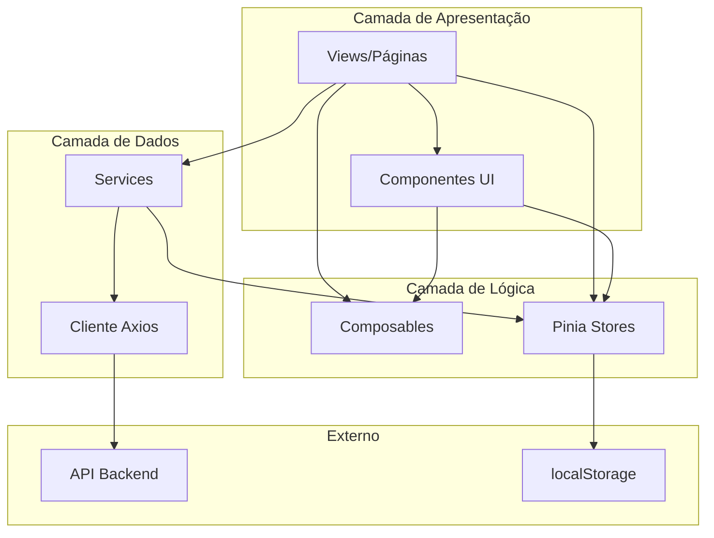
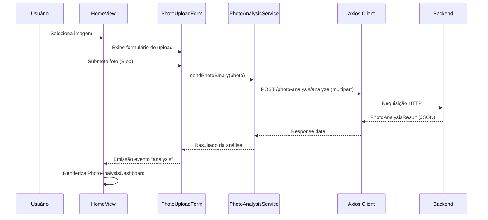
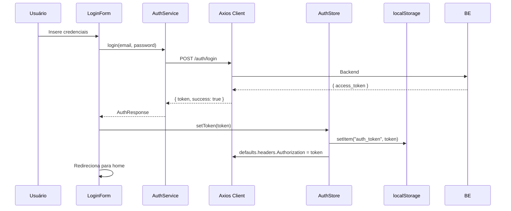
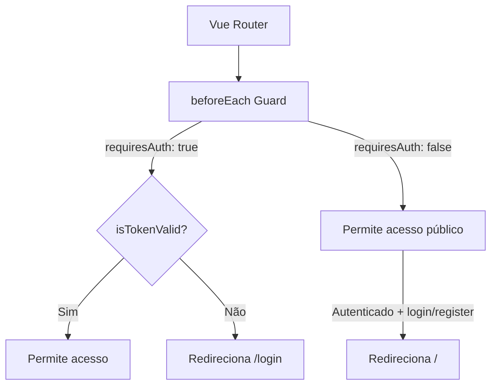

# Arquitetura

> **Gerado em:** 2026-07-15 | **Branch:** master | **Commit:** d137093

## Visão Geral

A aplicação segue uma arquitetura **SPA baseada em componentes** com separação em camadas lógicas: Views → Components → Services → Stores → API Client. O roteamento é gerido pelo Vue Router e o estado global pelo Pinia.

---

## Diagrama de Camadas

---

## Diagrama de Fluxo de Dados — Análise de Foto

---

## Diagrama de Fluxo de Autenticação

---

## Estrutura de Roteamento

---

## Layout da Aplicação

A aplicação utiliza `MainLayout.vue` como wrapper comum com:
- **Header** fixo com título e chip do usuário
- **Sidebar** com navegação (Menu PrimeVue) — drawer no mobile (< 1024px), fixa no desktop
- **Footer** fixo com copyright
- **Slot default** para conteúdo da view

---

## Notas

- O interceptor de resposta no Axios (`api.ts`) trata erros 401 globalmente, limpando o token e redirecionando para login.
- O `authStore.initializeFromStorage()` é chamado duas vezes: em `main.ts` e em `App.vue` (`onMounted`), o que é redundante.
- Cada Service constrói headers de Authorization manualmente em vez de depender exclusivamente do interceptor.
