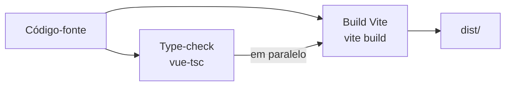
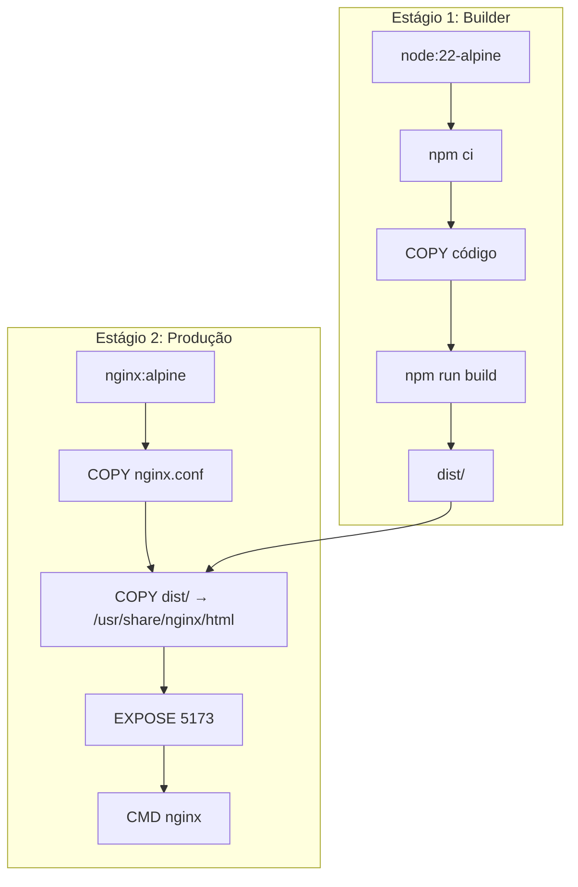

# Build e Deploy

> **Gerado em:** 2026-07-15 | **Branch:** master | **Commit:** d137093

## Pipeline de Build



---

## Scripts Disponíveis

| Script | Comando | Propósito |
|--------|---------|-----------|
| `dev` | `vite` | Servidor de desenvolvimento (HMR) |
| `build` | `run-p type-check "build-only {@}" --` | Build de produção (type-check + Vite) |
| `build-only` | `vite build` | Build sem type-check |
| `preview` | `vite preview` | Preview do build de produção |
| `type-check` | `vue-tsc --build` | Verificação de tipos |
| `lint` | `eslint . --fix --cache` | Lint com auto-fix |
| `format` | `prettier --write --experimental-cli src/` | Formatação |

---

## Build de Produção (Docker)



---

## Configuração Nginx

| Aspecto | Configuração |
|---------|-------------|
| Porta | 5173 |
| SPA Routing | `try_files $uri $uri/ /index.html` |
| Cache de Assets | 1 ano, `public, immutable` (js, css, png, jpg, etc.) |
| Cache index.html | `no-cache, no-store, must-revalidate` |
| Gzip | Ativado (nível 6) para tipos comuns |
| Upload máximo | 20 MB (`client_max_body_size`) |
| Health check | `/health` retorna 200 |

---

## Docker Compose

| Container | Imagem | Porta Host → Container |
|-----------|--------|----------------------|
| `photo-analysis` | Build local | 9393 → 5173 |

```bash
# Subir
docker compose up -d --build

# Atalho via Makefile
make create

# Logs
docker compose logs -f photo-analysis

# Parar
docker compose down
```

---

## Variáveis de Ambiente

| Variável | Padrão | Propósito |
|----------|--------|-----------|
| `VITE_BASE_SERVER_URL` | `http://localhost:3000` | URL do backend API |

---

## CI/CD

Não existe configuração de CI/CD (GitHub Actions, GitLab CI, etc.) no repositório.

---

## Notas

- O build usa `npm-run-all2` para executar type-check e Vite build em paralelo, otimizando o tempo de build.
- A porta do Nginx dentro do container é 5173 (mesma do Vite dev), o que é uma coincidência — na produção o Vite não roda.
- Não há pipeline de CI/CD automatizado.
