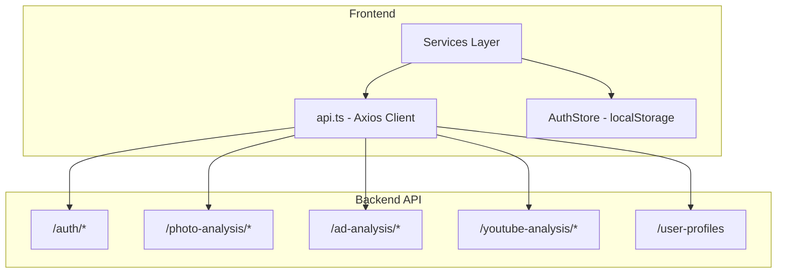

# Camada de Dados

> **Gerado em:** 2026-07-15 | **Branch:** master | **Commit:** d137093

## Visão Geral

A camada de dados é composta exclusivamente pelo **cliente Axios centralizado** (`api.ts`) e pelos **services** que o utilizam. Não há banco de dados local, ORM ou store de dados — toda a persistência real reside no backend.

---

## Diagrama da Camada de Dados

---

## Cliente Axios (`api.ts`)

| Aspecto              | Detalhe                                                |
| -------------------- | ------------------------------------------------------ |
| Base URL             | `import.meta.env.VITE_BASE_SERVER_URL`                 |
| Request Interceptor  | Injeta `Authorization: Bearer <token>` do localStorage |
| Response Interceptor | Captura 401 → remove token → redireciona para login    |
| Retry                | Flag `_retry` para evitar loop em 401                  |

---

## Persistência Local

A única persistência local é o token JWT no `localStorage`:

| Chave        | Valor      | Uso                          |
| ------------ | ---------- | ---------------------------- |
| `auth_token` | JWT string | Autenticação nas requisições |

O `AuthStore` gerencia o ciclo de vida do token:

- `initializeFromStorage()` — restaura token se válido
- `setToken()` — salva token + atualiza header do Axios
- `clearToken()` — remove token + limpa header

---

## Contratos de Dados por Serviço

### AuthService

| Operação | Método | Endpoint         | Request                  | Response                           |
| -------- | ------ | ---------------- | ------------------------ | ---------------------------------- |
| Registro | POST   | `/auth/register` | `{ username, password }` | `{ userId?, username?, message? }` |
| Login    | POST   | `/auth/login`    | `{ username, password }` | `{ access_token }`                 |
| Perfil   | POST   | `/auth/profile`  | —                        | `{ username }`                     |

### PhotoAnalysisService

| Operação          | Método | Endpoint                      | Request              | Response                                   |
| ----------------- | ------ | ----------------------------- | -------------------- | ------------------------------------------ |
| Enviar foto       | POST   | `/photo-analysis/analyze`     | FormData (multipart) | `PhotoAnalysisResult`                      |
| Listar resultados | GET    | `/photo-analysis/results`     | `?page=&limit=`      | `PaginatedResponse<PhotoAnalysisListItem>` |
| Detalhe           | GET    | `/photo-analysis/results/:id` | —                    | `PhotoAnalysisDetail`                      |

### AdAnalysisService

| Operação          | Método | Endpoint                   | Request         | Response                                |
| ----------------- | ------ | -------------------------- | --------------- | --------------------------------------- |
| Analisar anúncio  | GET    | `/ad-analysis/analyze`     | `?image_url=`   | `AdAnalysisResult`                      |
| Listar resultados | GET    | `/ad-analysis/results`     | `?page=&limit=` | `PaginatedResponse<AdAnalysisListItem>` |
| Detalhe           | GET    | `/ad-analysis/results/:id` | —               | `AdAnalysisResult`                      |

### YouTubeAnalysisService

| Operação          | Método | Endpoint                        | Request         | Response                                     |
| ----------------- | ------ | ------------------------------- | --------------- | -------------------------------------------- |
| Analisar vídeo    | GET    | `/youtube-analysis/analyze`     | `?url=`         | `YouTubeAnalysisResult`                      |
| Listar resultados | GET    | `/youtube-analysis/results`     | `?page=&limit=` | `PaginatedResponse<YouTubeAnalysisListItem>` |
| Detalhe           | GET    | `/youtube-analysis/results/:id` | —               | `YouTubeAnalysisDetail`                      |

### UserProfileService

| Operação         | Método | Endpoint         | Request       | Response              |
| ---------------- | ------ | ---------------- | ------------- | --------------------- |
| Criar perfil     | POST   | `/user-profiles` | `UserProfile` | `UserProfile`         |
| Atualizar perfil | PUT    | `/user-profiles` | `UserProfile` | `UserProfile`         |
| Buscar perfil    | GET    | `/user-profiles` | —             | `UserProfile \| null` |

---

## Notas

- Não existe camada de cache — cada requisição ao backend é feita diretamente.
- Não há gerenciamento de estado reativo para dados de análise — os resultados são mantidos como `ref` local nas views.
- O upload de foto usa `Content-Type: multipart/form-data` setado manualmente, o que pode conflitar com o auto-detect do Axios.
