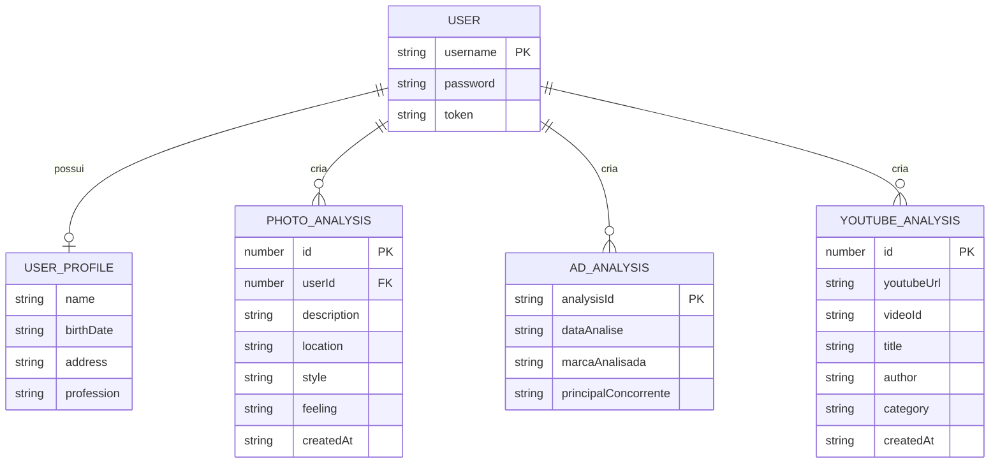

# Modelo de Domínio

> **Gerado em:** 2026-07-15 | **Branch:** master | **Commit:** d137093

## Entidades Principais

---

## PhotoAnalysisResult

Resultado detalhado da análise de foto retornado pelo backend.

| Campo | Tipo | Descrição |
|-------|------|-----------|
| `descricao_cena` | `string` | Descrição textual da cena |
| `objetos_identificados` | `string[]` | Lista de objetos detectados |
| `pessoas` | `{ quantidade, descricao }` | Informações sobre pessoas na imagem |
| `local_ambiente` | `string` | Local/ambiente identificado |
| `estilo_foto` | `string` | Estilo fotográfico |
| `sentimento_transmitido` | `string` | Sentimento transmitido pela imagem |
| `observacoes_adicionais` | `string` | Observações extras |

---

## AdAnalysisResult

Resultado da análise de anúncio, composto por três sub-entidades:

| Sub-entidade | Descrição |
|-------------|-----------|
| `comparador` | Análise comparativa da marca com concorrentes (SWOT simplificado) |
| `estrategia` | Sugestões de posicionamento e estratégia |
| `melhoria` | Pontos de melhoria e reformulação sugerida |

---

## YouTubeAnalysisResult

Metadados extraídos de um vídeo do YouTube.

| Campo | Tipo | Descrição |
|-------|------|-----------|
| `videoId` | `string` | ID do vídeo no YouTube |
| `title` | `string` | Título do vídeo |
| `author` | `string` | Autor/canal |
| `viewCount` | `string` | Número de visualizações |
| `likeCount` | `string` | Número de likes |
| `category` | `string` | Categoria do vídeo |
| `isLiveContent` | `boolean` | Indica se é conteúdo ao vivo |

---

## PaginatedResponse<T>

Container genérico para respostas paginadas.

| Campo | Tipo | Descrição |
|-------|------|-----------|
| `data` | `T[]` | Array de itens da página |
| `total` | `number` | Total de itens |
| `page` | `number` | Página atual |
| `limit` | `number` | Itens por página |
| `totalPages` | `number` | Total de páginas |

---

## Regras de Domínio

1. **Autenticação obrigatória**: Todas as rotas de análise exigem token JWT válido.
2. **Upload de imagem**: Apenas formatos PNG, JPG e JPEG são aceitos para análise de fotos.
3. **URLs de anúncio**: Devem iniciar com `http://` ou `https://`.
4. **URLs do YouTube**: Suporta formatos `youtube.com/watch?v=`, `youtu.be/`, `youtube.com/shorts/` e `youtube.com/embed/`.
5. **Timeout de análise**: Análises de anúncio e YouTube têm timeout de 120 segundos.
6. **Validação de senha**: Mínimo 8 caracteres, com pelo menos 1 maiúscula, 1 minúscula e 1 número.

---

## Notas

- Os campos do `PhotoAnalysisResult` usam snake_case (ex: `descricao_cena`), enquanto as demais entidades usam camelCase — inconsistência provavelmente herdada do backend.
- `AdAnalysisComparador` contém uma estrutura que lembra uma análise SWOT (forças, fraquezas, oportunidades, ameaças).
