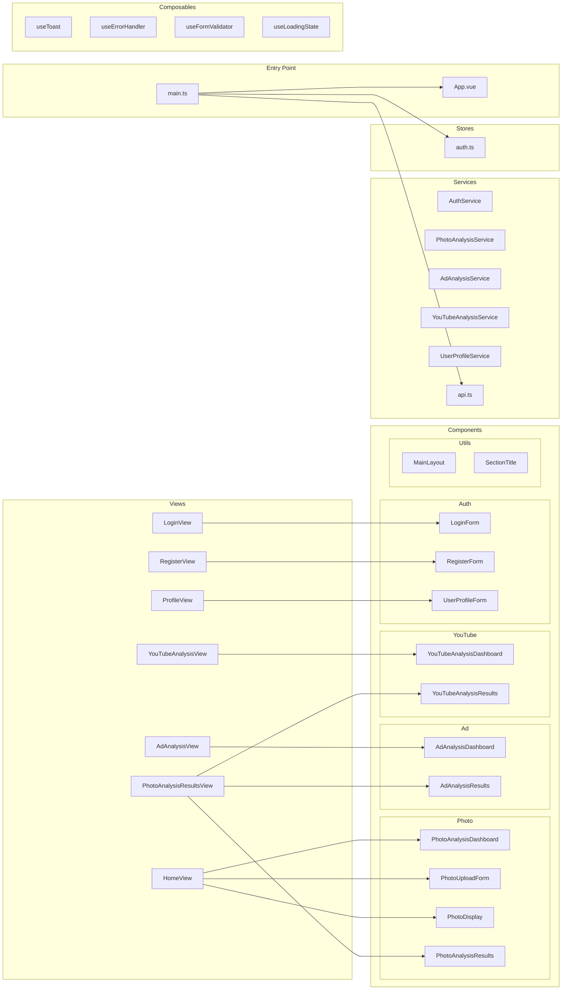

# Módulos

> **Gerado em:** 2026-07-15 | **Branch:** master | **Commit:** d137093

## Mapa de Módulos

---

## Detalhamento por Módulo

### `src/router/`

| Arquivo | Responsabilidade |
|---------|-----------------|
| `index.ts` | Definição de 7 rotas, lazy loading de views, guard de autenticação `beforeEach` |

### `src/views/`

| Arquivo | Responsabilidade |
|---------|-----------------|
| `HomeView.vue` | Página de upload e análise de fotos |
| `LoginView.vue` | Página de login (wrapper para LoginForm) |
| `RegisterView.vue` | Página de cadastro (wrapper para RegisterForm) |
| `ProfileView.vue` | Página de perfil do usuário |
| `PhotoAnalysisResultsView.vue` | Página de resultados com tabs (fotos, anúncios, YouTube) |
| `AdAnalysisView.vue` | Página de análise de anúncio por URL |
| `YouTubeAnalysisView.vue` | Página de análise de vídeo do YouTube |

### `src/components/photo/`

| Arquivo | Responsabilidade |
|---------|-----------------|
| `PhotoUploadForm.vue` | Formulário de upload de imagem (PNG/JPG/JPEG) |
| `PhotoDisplay.vue` | Exibição da imagem carregada |
| `PhotoAnalysisDashboard.vue` | Dashboard com resultado completo da análise |
| `PhotoAnalysisResults.vue` | Listagem paginada de análises anteriores |
| `PhotoAnalysisLocation.vue` | Card de local/ambiente |
| `PhotoAnalysisObjects.vue` | Card de objetos identificados |
| `PhotoAnalysisPeople.vue` | Card de pessoas detectadas |
| `PhotoAnalysisSentiment.vue` | Card de sentimento transmitido |
| `PhotoAnalysisStyle.vue` | Card de estilo fotográfico |
| `PhotoAnalysisNotes.vue` | Card de observações adicionais |

### `src/components/ad/`

| Arquivo | Responsabilidade |
|---------|-----------------|
| `AdAnalysisDashboard.vue` | Dashboard com comparador, estratégia e melhoria |
| `AdAnalysisResults.vue` | Listagem paginada de análises de anúncio |

### `src/components/youtube/`

| Arquivo | Responsabilidade |
|---------|-----------------|
| `YouTubeAnalysisDashboard.vue` | Dashboard com metadados do vídeo |
| `YouTubeAnalysisResults.vue` | Listagem paginada de análises de YouTube |

### `src/components/auth/`

| Arquivo | Responsabilidade |
|---------|-----------------|
| `LoginForm.vue` | Formulário de login |
| `RegisterForm.vue` | Formulário de cadastro |
| `UserProfileForm.vue` | Formulário de perfil do usuário |

### `src/components/utils/`

| Arquivo | Responsabilidade |
|---------|-----------------|
| `MainLayout.vue` | Layout principal (header, sidebar, footer, slot) |
| `SectionTitle.vue` | Componente de título de seção com PrimeVue Card |

### `src/services/`

| Arquivo | Responsabilidade |
|---------|-----------------|
| `api.ts` | Cliente Axios centralizado com interceptors de auth e 401 |
| `AuthService.ts` | Registro, login e perfil do usuário |
| `PhotoAnalysisService.ts` | Envio de foto e consulta de resultados |
| `AdAnalysisService.ts` | Análise de anúncio e consulta de resultados |
| `YouTubeAnalysisService.ts` | Análise de vídeo YouTube e consulta de resultados |
| `UserProfileService.ts` | CRUD de perfil do usuário |

### `src/stores/`

| Arquivo | Responsabilidade |
|---------|-----------------|
| `auth.ts` | Store de autenticação (token JWT, validade, perfil) |

### `src/composables/`

| Arquivo | Responsabilidade |
|---------|-----------------|
| `index.ts` | Re-exportação centralizada |
| `useToast.ts` | Wrapper para PrimeVue ToastService |
| `useErrorHandler.ts` | Tratamento padronizado de erros de API |
| `useFormValidator.ts` | Validação de formulários com regras configuráveis |
| `useLoadingState.ts` | Gerenciamento de estado de loading e erro |

### `src/types/`

| Arquivo | Responsabilidade |
|---------|-----------------|
| `PhotoAnalysisTypes.ts` | Tipos para análise de fotos |
| `AdAnalysisTypes.ts` | Tipos para análise de anúncios |
| `YouTubeAnalysisTypes.ts` | Tipos para análise de YouTube |
| `PaginatedResponse.ts` | Tipo genérico de resposta paginada |

---

## Notas

- Views com `.meta.requiresAuth: true` são protegidas pelo guard global do router.
- Views de login e register são wrappers finos que delegam para componentes de formulário.
- Todos os services seguem o padrão de classe com métodos estáticos, exceto `AuthService` e `UserProfileService` que usam instância singleton (`export default new ...`).
