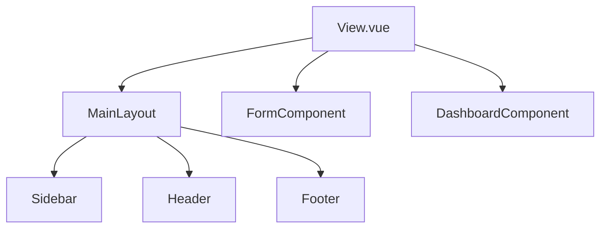
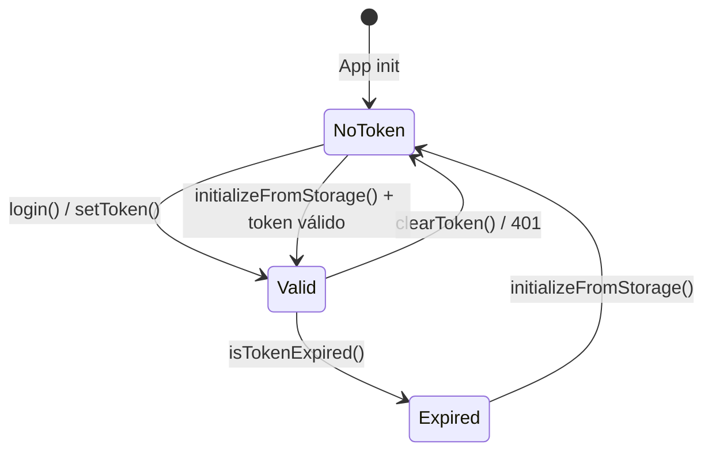

# Padrões Recorrentes

> **Gerado em:** 2026-07-15 | **Branch:** master | **Commit:** d137093

## 1. Service Class Pattern

Todos os services são implementados como classes TypeScript com métodos que encapsulam chamadas ao cliente Axios centralizado.

**Variante A — Singleton (instância exportada):**
```typescript
class AuthService { async login(...) { ... } }
export default new AuthService()
```
Usado por: `AuthService`, `UserProfileService`

**Variante B — Métodos estáticos:**
```typescript
export default class PhotoAnalysisService {
    static async sendPhotoBinary(...) { ... }
}
```
Usado por: `PhotoAnalysisService`, `AdAnalysisService`, `YouTubeAnalysisService`

---

## 2. Auth Header Manual nos Services

Todos os services que fazem requisições autenticadas constroem manualmente o header `Authorization` lendo o token do `authStore`, mesmo que o interceptor de request em `api.ts` já faça isso.

```typescript
const authStore = useAuthStore()
const headers: Record<string, string> = {}
if (authStore.token) {
    headers['Authorization'] = `Bearer ${authStore.token}`
}
```

---

## 3. Error Handling Pattern

Dois padrões coexistem para tratamento de erros:

- **Try-catch com retorno de objeto de sucesso/erro** — usado em `AuthService` e `UserProfileService` (retorna `{ success, message, data? }`)
- **Composable `useErrorHandler`** — usado em views de análise (`AdAnalysisView`, `YouTubeAnalysisView`) para exibir toast de erro

---

## 4. Composable Pattern

Composables seguem o padrão Vue 3 de funções composáveis que retornam refs e métodos reativos.

| Composable | Responsabilidade |
|-----------|-----------------|
| `useToast` | Wrapper do PrimeVue ToastService |
| `useErrorHandler` | Handler padronizado com `ApiError` customizado |
| `useFormValidator` | Validação declarativa com regras configuráveis |
| `useLoadingState` | Estado reativo de loading/erro com `withLoading` wrapper |

---

## 5. View-Component Composition

Views são componentes finos que compõem layout + componentes filhos:



---

## 6. Lazy Loading de Views

Todas as views são importadas com lazy loading no router:

```typescript
const HomeView = () => import('@/views/HomeView.vue')
```

---

## 7. JWT Token Lifecycle



---

## 8. Paginated Results

Os services de listagem (`listResults`) seguem o mesmo contrato: recebem `pageNumber` e `pageLimit`, retornam `PaginatedResponse<T>`.

---

## Notas

- A duplicação de auth headers (interceptor + manual nos services) é um padrão redundante que pode ser simplificado.
- A inconsistência entre singleton e métodos estáticos nos services não parece intencional.
